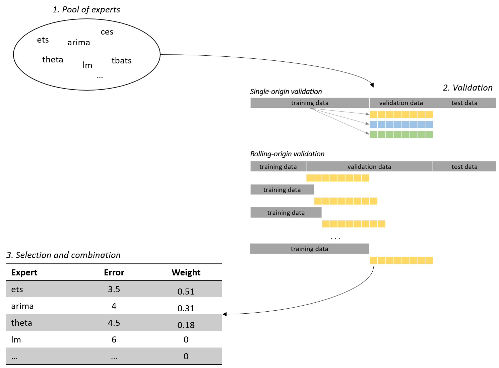

# Package 'Forunco'

This package aims implements statistical and machine learning algorithms that can be integrated into business intelligence solutions; either via `sp_execute_external_script` in T-SQL or any other R-interface (such as e.g. Power-BI). The main focus of this package are automatic prediction algorithms, that can be easily implemented in customer projects or in presentations. Also, functions for customizing existing or building new models are provided.

## Package installation

### Installation via github

Note that you need access the this repository to do this; please ask the maintainer (ypmauron@gmail.com) for a github_pat.

```{R}
library(devtools)
devtools::install_github(repo = 'yvesmauron/univariate-time-series-forecasting', ref = 'master')
```

### Installation via Docker Image

The entire package is also available as Docker Image and can therefore be installed as follows. 

```{sh}
docker pull maurony/forunco:latest
```
Note that the package will come with additional time-series forecasting libraries and Microsoft R Open already installed on it. Again, at the moment this is all privately held and therefore you need the ask the maintainer (ypmauron@gmail.com) to give you the respective permissions.

## Time series forecasting

The following sections describe how the implemented algorithm can be used, how it internally works (high-level) as well as how it performs on empirical datasets.

### The Algorithm

The main idea of the algorithm is to **fit** several forecasting methods (hereafter referred to as `experts`), **select** the best `n` ones per time series (selection) and **combine** the selected ones using a combination operator of your choice (mean, median, weighted average etc.). The selection of the experts is either achieved by manually selecting them (on the basis of prior knowledge) and let the algorithm only define the combination weights or, to let the algorithm select from a pool of experts and combine them based on the validation error. In recent literature, similar approaches - often referred to as  `combination` and `selection` - performed very well, eventually being one of the most accurate approaches used in many time series competitions, such as [M3](https://pdfs.semanticscholar.org/8461/b79f9747a0caee85522c49bd4655c64e10fb.pdf) and the very recent [M4](https://www.sciencedirect.com/science/article/pii/S0169207018300785) competition.

On a high level, the algorithm can be split into the following three major parts:



, whereas each step of the process can be summarized as follows:

1. _Definition of the pool of experts:_ The forecasting experts can be any forecasting method, that returns a list having at least following three named items: mean, upper and lower; whereas the mean corresponds to the point forecast and upper (lower) corresponds to the upper (lower) prediction intervals. For performance reasons it makes sense not to specify too many experts, as all of these have to be evaluated in the following steps.
2. _Validation:_ The validation process is the core of this algorithm, ultimately deciding which method will be selected and which weight each experts gets. To compare experts from different model families (ets, arima); one cannot rely on information criterions such as e.g. AICC [(see Hyndman, 2013)](https://robjhyndman.com/hyndsight/aic/) but has to perform out-of-sample tests; whereas the following two major types of out-of-sample tests are considered in this package (see figure above):
    *	*Fixed-origin validation:* To perform a fixed-origin validation, the data has to be split in training, validation and test data, whereas the validation and test data usually corresponds to the required forecasting horizon. Then all experts produce forecasts from a single forecasting origin by only using the training data and validate the forecasting accuracy with the validation data using an appropriate error measure. The selection and combination is then based on these accuracy measures.
	*   *Rolling-origin validation:* This validation works similar as the previously described fixed-origin evaluation, but it continuously updates its origin. After calculating the forecast for each method from every origin, the forecasting accuracy of each method over all origins is used to determine the performance of an export for a particular time series. While single-origin validation relies only on a single set of observations, rolling-origin validation does not. This makes cross-validation less susceptible to corruption by occurrences unique to a certain origin. However, cross-validation requires also more in-sample data as single validation and is computationally more expensive. Hence, one might choose to reduce the number of origins and thus get the best of both approaches; if enough data is available.
3. *Selection and combination of experts*: In this step, the accuracy of the experts is compared - possibly for multiple test-sets, the experts are selected and finally combined using a combination operator. The combination operator can be defined by the user and is typically based on the accuracy achieved during the validation process. Furthermore, the package allows to combine methods per horizon; meaning that horizon one might be calculated using other combination weights or even experts than horizon two.

All parameters relevant to the training process (experts, pre-processing methods, validation method, combination method, error function etc.) can be defined by the user and are described in more detail in the [package documentation](./forunco.pdf); or directly in the code itself with comment blocks. Also, the dynamic implementation of this package also allows new, custom e.g. combination or weight determination methods to be defined and passed to the algorithm. Please note, however, that sometimes the parameters for the validation process are adjusted because e.g. to little training data is available. To read more about the benefits of forecasting combination and selection, one might start with this [article](https://researchportal.bath.ac.uk/en/publications/another-look-at-forecast-selection-and-combination-evidence-from-).

### Usage

Generally, the time series forecasting functions generally expects at least 2 parameters,

1. a time series object and
2. the number horizons to be predicted.

However, additional parameters can be used to select additional algorithms, combination methods for point forecasts and prediction intervals or/and weight selection methods. Some of the parameters allow also to use user defined functions; for more details about the parameters and how to extend this forecasting library, please see the [technical documentation](./docs/forunco.pdf).

Furthermore, the usage slightly differs for different compute contexts; thus, the following subsections introduce the specific parametrization for different compute contexts.

#### Native R

Individual time series can be forecasted directly with the ``forunco`` method,  more specifically as follows:

```{R}
# load package
library(forunco)
# get time series data
library(Mcomp)
ts <- M3[[2500]]$x
# forecast the time series
predictions <- forunco::forunco(
  y = ts, # the time series object
  h = 12  # the number of horizons to predict
          # potentially additional parameters
)
```

For batch forecasting, you can and - for performance reasons - should use multiple cores and parallelize the workload. Parallelized batch forecasting is implemented in the ```forecast_forunco``` function - which makes use of the native R parallelization packages ```foreach``` and ```doSNOW``` - and can be used as follows:

```{R}
# load package
library(forunco)
# get time series data; here 500 time series of M3
library(Mcomp)
ts_col <- M3[[2000:2500]]$x
# a time series colllection has n elements, each of which is a time series
# object.
ts_col <- lapply(m_ts, function(x) {x$x})
# forecast the time series
predictions <-
  forunco::forecast_forunco(
    ts_col, # time series collection
    h = 12, # horizons to predict
    num_cores = NULL, # number of cores; default all
    num_cores_ignore = 1, # number of cores to ignore for parallelization
    prog_bar = T, # whether or not a progress bar should be displayed
    # potentially additional parameters
)
```

#### R on Machine Learning Service with SQL Server

> Note that this functionality was not tested since the migration; if you ecounter issues, please open a corresponding issue.

In the following, a guidance for installing and enabling the necessary features in SQL Server is given.

##### Manual installation

To use `forunco` you need to install the binary of the package and all of its dependencies for the R version of the respective R MLS. This can be achieved by running the script below on the console R application of MLS (`R.exe`) located by default in the following directory `C:/Program Files/Microsoft SQL Server/<YOUR_INSTANCE_NAME>/R_SERVICES/bin` (please do not forget to replace `<YOUR_INSTANCE_NAME>` with your instance name):

```{R}
# install dependencies
libPath <- 'C:/Program Files/Microsoft SQL Server/<YOUR_INSTANCE_NAME>/R_SERVICES/library'
pkgs <-  c(
  'forecast'
  ,'smooth'
  ,'forecTheta'
  ,'tidyr'
  ,'plyr'
  ,'dplyr'
  ,'tibble'
  ,'ggplot2'
  ,'lubridate'
  ,'foreach'
  ,'doSNOW'
  ,'parallel'
  ,'progress'
)
install.packages(pkgs = pkgs, lib = libPath)

# install forunco
install.packages(
    pkgs = 'path/to/zip/package/file/forunco_0.0.0.9.zip',
    lib = libPath,
    type = 'source',
    repos = NULL)
```

##### Machine Learning Services

The scripts are meant to run in parallel using [Microsoft Machine Learning Services (MLS)](https://docs.microsoft.com/en-us/sql/advanced-analytics/what-is-sql-server-machine-learning?view=sql-server-2017). To add this feature to an existing SQL Server instance or to install a new standalone Machine Learning Server, please follow the respective [installation instructions](https://docs.microsoft.com/en-us/sql/advanced-analytics/install/sql-machine-learning-services-windows-install?view=sql-server-2017).

Please note that MLS is likely to use an older version of R than available on the web; the current package uses the latest R version supported by [SQL Server 2017](https://docs.microsoft.com/en-us/sql/advanced-analytics/r/use-sqlbindr-exe-to-upgrade-an-instance-of-sql-server?view=sql-server-2017); more precisely:

```{R}
> version

platform       x86_64-w64-mingw32          
arch           x86_64                      
os             mingw32                     
system         x86_64, mingw32             
status                                     
major          3                           
minor          3.3                         
year           2017                        
month          03                          
day            06                          
svn rev        72310                       
language       R                           
version.string R version 3.3.3 (2017-03-06)
nickname       Another Canoe     
```

Please note, that code implemented using a newer version of Microsoft R Open might not work on the MLS (SQL Server 2017).

Furthermore, you need to reconfigure the SQL Server to allow external scripts. To do this, please execute the following command on the instance:

```{SQL}
sp_configure 'external scripts enabled', 1;
RECONFIGURE WITH OVERRIDE;  
```

Sometimes the server instance has to be restarted to change the `run_config`; to do this, go to `Services` and restart the corresponding SQL Server Instance.

##### Execute Stored procedure

Furthermore, this package can be used with the MLS described above directly via T-SQL. If you have installed `forunco` correctly (see above), you can predict time series data stored in tables simply by executing the following stored procedure:

```SQL
EXEC sp_execute_external_script  
 @language = N'R'  
,@script = N'  
  library(forunco);  
  result <- rx_sql_forunco(
	  connection_string = connection_string,
	  table = table,
	  h = horizons,
	  num_cores = 8,
    levels = c(95),
    methods = c("auto_ets", "auto_arima", "auto_thetaf"),
    point_combination = "median",
    pi_combination_upper = "median",
    pi_combination_lower = "median",
    pool_limit = length(methods),
    error_fun = "rmse",
    weight_fun = "inverse",
    val_h = h,
    sov_only = F,
    max_years = 30,
    val_min_years = 4,
    cv_min_years = 5,
    cv_max_samples = 3,
    allow_negatives = F
)'
,@input_data_1 = N''  
,@output_data_1_name  = N'result'  
,@params = N'@table NVARCHAR(50), @connection_string NVARCHAR(150), @horizons INT'
,@connection_string = 'Server=LTYMA01\QWERTZ;Database=FORECASTING_DATA;UID=ruser;PWD=ruser;'
,@table = 'fcs.InputData'
,@horizons = @horizons;
```

, where `@connection_string` is the connection string to the database with the `@table` storing the time series data and `@horizons` is the number of time steps to be predicted. Additional parameters for the forunco function can be set within the script, please see the [package documentation](./docs/forunco.pdf) for the description of the parameters.

Please note, however, that extensive preprocessing , especially for business time series, is often (if not always) required to get accurate predictions. The vast majority of these tasks are implemented directly in the functions provided by `forunco`, however, some minimal standards of the input data are expected; more specifically

1. No missing data points; if certain periods do not have any values, a 0 is expected.
2. Same aggregation level for each data point.

Additionally, one might also think about using calendar adjustment techniques to fight calendar effects (varying business days in a month, varying month lengths etc.) using common techniques before feeding the data into the forecasting algorithm. To facilitate this preprocessing tasks, the package provides a minimal viable stored procedure that takes care of missing values and calendar adjustments automatically. The stored procedure [`usp_forunco`](./sql/usp_forunco.sql) can be used as any other stored procedure directly via T-SQL:

```SQL
USE YOUR_DB;

DECLARE	@return_value int

EXEC	@return_value = [dbo].[usp_forunco]
		    @schema = N'schema', -- schema name
        @table = N'table', -- table name
        @date_col = N'date_col', -- column that should be used as date (i.e. Payment Date)
        @value_col = N'val_col', -- column that should be used for the values (i.e. Sales Amount)
        @group_col = N'group_col', -- the column that groups the series (i.e. ProductNr)
        @agg_level = N'Month', -- aggregation level (Year, Quarter, Month, Week, Day)
        @agg_date_fun = N'MIN', -- aggregation function to be used for date aggregation
        @calendar_adjustment = N'even', -- calendar adjustment (avg, even, none); see above
        @omit_leap_days = 1, -- if leap days should be removed, strongy advisable for even and none, with avg you can remove it.
        @horizons = 18 -- the number of horizons (time-steps) to predict

SELECT	'Return Value' = @return_value

GO
```

Note that parameters for the R function [`forunco`](./docs/forunco.pdf) are not all available per default for the stored procedure, but are rather hard-coded in the stored procedure. However, if desired, they may also be added to the stored procedure parameters similar to the parameter `@horizons`; please note however, that you should check the validity of all inputs fed into R to prevent R-specific error messages.
